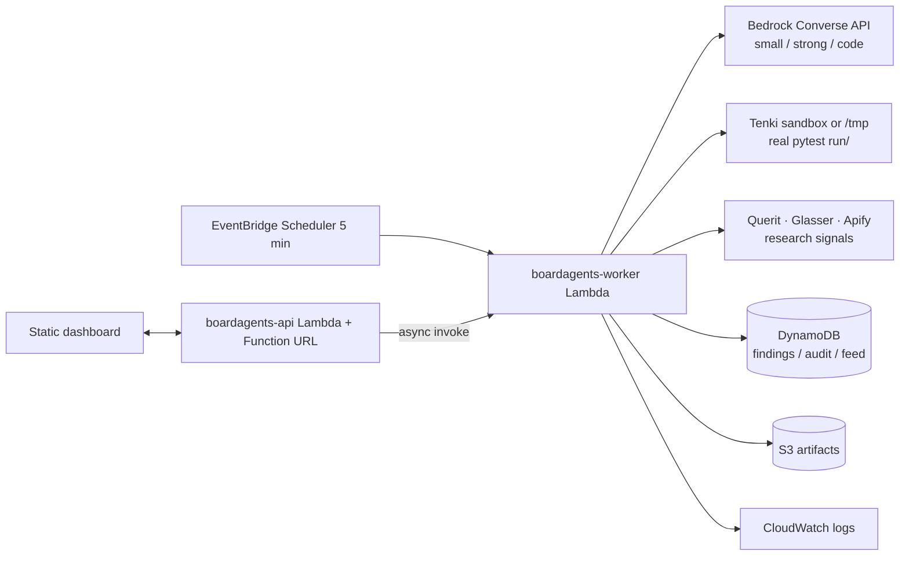

# Boardagents

**An autonomous board member for founders who have no board.**

A solo founder or student startup has no CTO, no CFO, and nobody to sanity-check a decision
at 2 a.m. Boardagents watches company signals, summarizes them into findings with evidence
and confidence, decides what to do, acts autonomously **only when the risk tag allows it**,
verifies its own work by running real tests, passes everything through a governance
checklist, and logs every step. Anything sensitive is drafted for human approval — never
acted on alone, no matter how confident the model claims to be.

> **Lumen Labs, the company in the demo, is simulated.** All data, events and code in
> `demo_company/` are fixtures built for this demo. Nothing here watches a real company.

**Live demo:** https://wcjhb3duaxyb6csveaxehrl2aa0mecwj.lambda-url.ap-south-1.on.aws/

## Try it in 60 seconds

1. Open the live demo and type a decision in **Ask your board** — four agent
   seats (CTO, CFO, Risk, Growth, each on a different model) debate and vote.
2. Or click **A**, **B**, **C** to run scripted scenarios: a low-risk
   dependency fix, a sensitive billing anomaly, an ambiguous usage dip.
3. Click any item to read its summary, votes, patch diff, governance
   checklist, and full audit trail.

## How it works

EventBridge Scheduler fires every 5 minutes → a worker Lambda ingests raw events, and an
orchestrator walks each finding through a state machine:

```
Ingested → Summarized → Decided → ActingDirect | AwaitingApproval | Escalated
ActingDirect → Verifying → GovernanceReview | (retry) | Escalated
GovernanceReview → Closed | Escalated
```

- **Risk is derived from `event_type` by deterministic code. The model never decides risk.**
  A policy engine routes: high confidence + low risk → act autonomously; anything sensitive
  → draft for human approval even at high confidence; low confidence → escalate.
- **Policy always wins over the model.** When they disagree, a `policy_override` audit row
  is written.
- **Verification truth comes only from a real pytest run in a sandbox.** The model's claim
  of "tests pass" is never trusted.
- Every LLM call, transition, attempt and governance check is appended to DynamoDB.

## Agents

| Agent | Job |
|---|---|
| Monitor | Watches the feed, classifies events, opens findings. No AI. |
| Research | Attaches fresh web sources to every finding (Querit). |
| Data | Enriches company mentions with firmographics (Glasser). |
| Scraper | Fetches linked pages as markdown evidence (Apify). |
| Board (CTO / CFO / Risk / Growth) | Debates founder questions, votes, drafts motions. |
| Decision | Proposes a route; the policy engine decides. |
| Action | Patches code in a sandbox, runs real pytest, retries red runs. |
| Governance | Deterministic checklist; the model may only add concerns. |

## Architecture



| AWS service | Role |
|---|---|
| Lambda | Both worker and API. Pay per ms, no idle cost, fits a free-credit budget. |
| Function URL | Public dashboard URL without API Gateway setup. |
| Bedrock (Converse API) | Models for summarize / decide / code / governance, routed per stage. |
| DynamoDB (on-demand) | Findings, append-only audit trail, event feed. |
| S3 | Patches, diffs and test output per attempt. |
| EventBridge Scheduler | The 5-minute monitor trigger. |
| CloudWatch Logs | Run logs, 14-day retention. |

## Deploy

```bash
./scripts/deploy.sh    # build + deploy + print the URL
./scripts/teardown.sh  # remove the stack
```

Stack name defaults to `boardagents`; `STACK=myboard ./scripts/deploy.sh`
deploys an isolated copy. Secrets come from `.env` (gitignored) — copy
`.env.example` and fill in the keys.

## Sponsor tooling

- **RocketRide** — the summarize / decide / governance stages also exist as portable
  pipelines in `pipelines/*.pipe`. Run one against a Cloud or local engine with
  `python scripts/rr_stage.py summarize '{"title": "mailkit EOL"}'`.
- **Querit** — the research agent attaches fresh web sources to every ingested
  finding (`payload.web`) when `QUERIT_API_KEY` is set; without a key it stays silent.
- **Glasser** — the data agent enriches company mentions (`payload.companies`) via
  the Glasser CLI when `GLASSER_API_KEY` is set; silent without it.
- **Apify** — the scraping agent fetches linked pages as markdown (`payload.page`)
  when `APIFY_TOKEN` is set; silent without it.
- **Tenki** — verification pytest runs inside a Tenki sandbox session
  (`src/core/sandbox.py`) when the CLI and `TENKI_API_KEY` are present; otherwise
  the local `/tmp` sandbox is used.
- **Prelint** — every PR is product-reviewed against `docs/PRODUCT_SPEC.md` plus
  the rules in `prelint.json`.

## Architecture and cost decisions

- **Lambda over EC2/containers:** workload is spiky (one finding per injected event), so a
  serverless worker costs effectively nothing between runs. On the free plan, EC2 or Fargate
  would idle-charge.
- **DynamoDB on-demand:** traffic is unpredictable and tiny; fixed capacity would be paying
  for idle.
- **Bedrock Converse API:** one request/response shape across every model family, so the
  router swaps models by editing config only.
- **No Step Functions:** the state machine, retries and governance checklist are hand-written.
  The transition table is ~20 lines of Python, testable offline, and the audit rows come from
  the same code that mutates state.
- **Reserved concurrency:** impossible on an account limited to 10 concurrent executions
  (AWS requires ≥100 unreserved), so protection is app-level: call caps, a daily counter and
  a pause flag.

Measured cost per scenario run is documented in `docs/preflight.md`.

## Honest limitations

- Simulated company data, not a real deployment.
- The "sandbox" is a copy of a small demo repo, executed on the worker's `/tmp`.
- Single tenant; no auth beyond a demo token for destructive actions.
- No calibration claims beyond what the audit log records.

